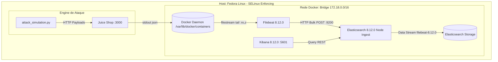

# Engenharia e Topologia do Homelab Purple Team

## 1. Topologia de Rede e Pipeline de Dados

---

## 2. Parâmetros Operacionais de Infraestrutura

| Componente | Imagem / Runtime | Mapeamento de Portas | Configuração de Execução | Contexto de Segurança |
| :--- | :--- | :--- | :--- | :--- |
| **Target** | `bkimminich/juice-shop:latest` | `3000:3000/tcp` | Node.js Express em stdout nativo | `container_file_t` padrão |
| **Log Shipper** | `docker.elastic.co/beats/filebeat:8.12.0` | N/A | `user: root`, flag `--strict.perms=false` | Bind mounts rotulados com `:ro,z` |
| **Ingest / SIEM** | `docker.elastic.co/elasticsearch/elasticsearch:8.12.0` | `9200:9200/tcp` | `discovery.type=single-node`, `xpack.security.enabled=false` | Volumes anônimos/isolados Docker |
| **UI / Visualizer**| `docker.elastic.co/kibana/kibana:8.12.0` | `5601:5601/tcp` | `ELASTICSEARCH_HOSTS=http://elasticsearch:9200` | Rede bridge interna |

---

## 3. Peculiaridades de Kernel e SELinux (Fedora Linux Nativo)

* **Contexto de Rotulagem SELinux (`:z`)**:
  No Fedora com modo `Enforcing`, contêineres Docker executam sob o contexto `system_u:system_r:container_t:s0:c...`. O acesso a diretórios do host (`/var/run/docker.sock`, `/var/lib/docker/containers` e `./filebeat.yml`) exige o sufixo `:z` ou `:ro,z`. O Docker Engine invoca `setfiles` para re-rotular os inodos com o tipo `container_file_t`, prevenindo negações AVC (*Access Vector Cache*).
* **Permissões de Arquivo do Beat**:
  Arquivos mapeados do host preservam o UID/GID do usuário criador. Como o Filebeat é executado via `root` no container para ler os diretórios em `/var/lib/docker/containers`, a diretiva `--strict.perms=false` é mandatória no entrypoint para ignorar a validação de propriedade estrita do arquivo de configuração (`0644`).

---

## 4. Latência e Dimensionamento do Pipeline

A latência total de telemetria entre o disparo do ataque e a disponibilidade analítica no Elasticsearch obedece à equação:

$$\Delta T_{total} = T_{flush\_stdout} + T_{filebeat\_harvest} + T_{ingest\_pipeline} + T_{es\_index}$$

* **$T_{flush\_stdout}$**: Bufferização da aplicação Node.js ($\approx 0\text{ a }50\text{ ms}$).
* **$T_{filebeat\_harvest}$**: Intervalo configurado no filestream (`close.reader.after_interval`, `scan_frequency` default: $10\text{ s}$).
* **$T_{ingest\_pipeline}$**: Execução Grok e processadores condicionais Painless ($\le 2\text{ ms}$ por documento).
* **$T_{es\_index}$**: Elasticsearch index refresh interval ($1\text{ s}$ por padrão).
* **Latência Esperada de Indexação**: $1\text{ s} \le \Delta T_{total} \le 11\text{ s}$.
