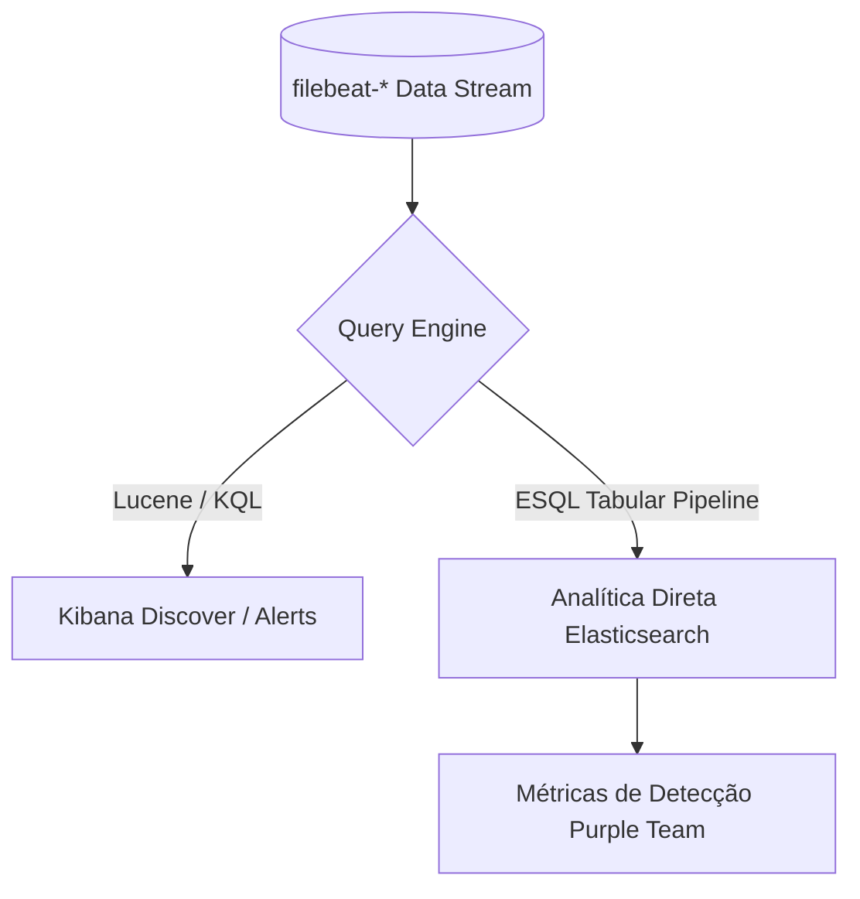

# Engenharia de Detecção e Métricas Blue Team

## 1. Fluxo de Análise e Detecção



---

## 2. Regras de Detecção Formalizadas

### A. Injeção de SQL (T1190)
* **KQL (Kibana Query Language)**:
  ```kql
  rule.category: "threat/sql-injection" OR url.path: (*%27* OR *--* OR *1=1*)
  ```
* **ES|QL (Elasticsearch Query Language)**:
  ```esql
  FROM filebeat-*
  | WHERE rule.category == "threat/sql-injection" OR url.path LIKE "*%27*" OR url.path LIKE "*--*"
  | KEEP @timestamp, http.request.method, url.path, http.response.status_code
  | SORT @timestamp DESC
  | LIMIT 20
  ```

### B. Traversal e Acesso a Arquivos Sensíveis (T1083)
* **KQL**:
  ```kql
  rule.category: "threat/path-traversal" OR url.path: (*..* OR *%2e%2e* OR *etc/passwd*)
  ```
* **ES|QL**:
  ```esql
  FROM filebeat-*
  | WHERE rule.category == "threat/path-traversal" OR url.path LIKE "*..*" OR url.path LIKE "*%2e%2e*"
  | STATS incidentes = COUNT(*) BY http.response.status_code, url.path
  | SORT incidentes DESC
  ```

### C. Detecção de Varredura e Enumeração (T1595.003)
* **ES|QL com Agregação Temporal**:
  ```esql
  FROM filebeat-*
  | WHERE http.response.status_code == 404 OR http.response.status_code == 403
  | STATS falhas = COUNT(*) BY client.ip, http.response.status_code
  | WHERE falhas >= 5
  ```

---

## 3. Formulação de Métricas de Eficácia Purple Team

A eficácia de cobertura analítica do laboratório é avaliada matematicamente via Cobertura de Detecção ($C_{detection}$) e Cobertura de Parsing ($C_{parsing}$):

$$C_{detection} = \frac{\sum D_{identificados}}{\sum A_{disparados}} \times 100$$

Onde:
* $D_{identificados}$: Eventos capturados pelo Ingest Pipeline onde `rule.category` foi preenchido corretamente.
* $A_{disparados}$: Número total de vetores ofensivos emitidos pelo `attack_simulation.py`.

$$C_{parsing} = \frac{N_{parsed}}{N_{parsed} + N_{on\_failure}} \times 100$$

* **Target de Qualidade**: $C_{parsing} = 100\%$ e $C_{detection} \ge 90\%$.
