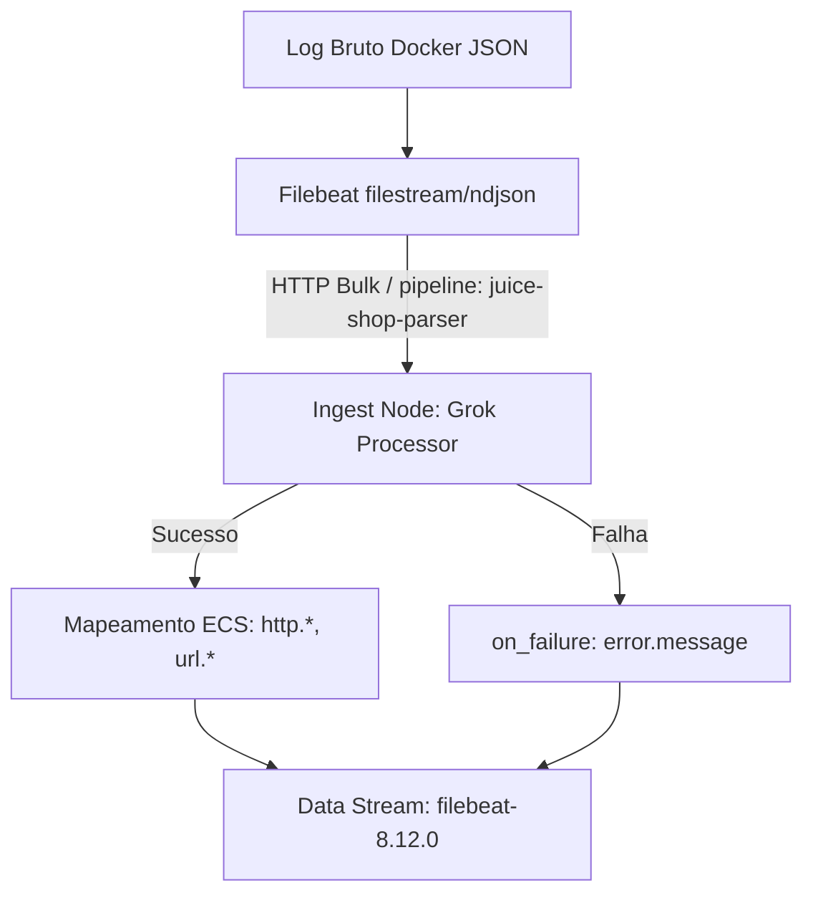

# Pipeline de Ingestão e Mapeamento ECS

## 1. Fluxo de Parsing e Enriquecimento



---

## 2. Estrutura do Ingest Pipeline (`juice-shop-parser`)

O pipeline processa a carga útil textual contida no campo `message` originada do contêiner do Juice Shop.

### Configuração do Pipeline (JSON)
```json
{
  "description": "Pipeline de extração e mapeamento ECS para logs HTTP do Juice Shop",
  "processors": [
    {
      "grok": {
        "field": "message",
        "patterns": [
          "%{WORD:http.request.method} %{URIPATHPARAM:url.path} %{NUMBER:http.response.status_code:int}"
        ],
        "ignore_missing": true
      }
    }
  ],
  "on_failure": [
    {
      "set": {
        "field": "error.message",
        "value": "{{ _ingest.on_failure_message }}"
      }
    }
  ]
}
```

---

## 3. Mapeamento de Campos (Elastic Common Schema - ECS)

| Campo Bruto (Log Textual) | Campo ECS Target | Tipo | Descrição |
| :--- | :--- | :--- | :--- |
| Verbo HTTP (ex: `GET`, `POST`) | `http.request.method` | `keyword` | Método utilizado na requisição web |
| Caminho/Query (ex: `/rest/products/search?q=`) | `url.path` | `wildcard` / `keyword` | URI alvo da requisição incluindo parâmetros |
| Código de Retorno (ex: `200`, `500`) | `http.response.status_code` | `long` | Código de status HTTP convertido para inteiro |
| Exceção interna | `error.message` | `text` | Mensagem de erro capturada caso o Grok falhe |

---

## 4. Validação do Pipeline via API

Teste de simulação de ingestão direta no Elasticsearch:

```bash
curl -s -X POST "http://localhost:9200/_ingest/pipeline/juice-shop-parser/_simulate" \
  -H "Content-Type: application/json" -d '\
{
  "docs": [
    {
      "_source": {
        "message": "GET /rest/products/search?q=test 200"
      }
    }
  ]
}'
```
