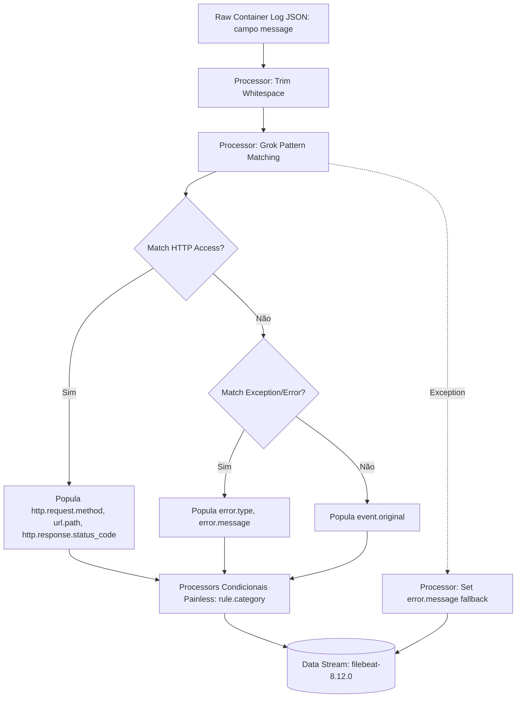

# Engenharia do Ingest Pipeline e Mapeamento ECS

## 1. Fluxo de Parsing e Pipeline Grok



---

## 2. Mapeamento Formal Elastic Common Schema (ECS)

| Campo Bruto (Juice Shop / Docker) | Destino ECS | Tipo ES | Expressão / Regex Grok |
| :--- | :--- | :--- | :--- |
| Método HTTP (`GET`, `POST`) | `http.request.method` | `keyword` | `%{WORD:http.request.method}` |
| URI / Parâmetros (`/rest/products/search?q=`) | `url.path` | `wildcard` / `keyword` | `%{URIPATHPARAM:url.path}` |
| Código de Retorno (`200`, `404`) | `http.response.status_code` | `long` | `%{NUMBER:http.response.status_code:int}` |
| Classe de Exceção (`SQLITE_ERROR`) | `error.type` | `keyword` | `Error: %{WORD:error.type}` |
| Detalhe do Erro | `error.message` | `text` | `%{GREEDYDATA:error.message}` |
| Categoria Purple Team | `rule.category` | `keyword` | Condicional Painless (`threat/*`) |

---

## 3. Algoritmo de Categorização Condicional (Ingest Node)

A classificação categórica ocorre em nível de pipeline no cluster Elasticsearch sem overhead de agentes externos:

* **SQL Injection (`threat/sql-injection`)**:
  $$\text{Condição} = (\text{error.type} = \text{"SQLITE_ERROR"}) \lor (\text{url.path} \supset [\%27, --, 1=1])$$[cite: 1]
* **Path Traversal (`threat/path-traversal`)**:
  $$\text{Condição} = \text{url.path} \supset [.., /etc/passwd, \%2e\%2e]$$
* **Cross-Site Scripting (`threat/xss`)**:
  $$\text{Condição} = \text{url.path} \supset [<script>, \%3Cscript\%3E, javascript:, onerror]$$
* **Web Enumeration (`threat/enumeration`)**:
  $$\text{Condição} = (\text{status\_code} \in \{403, 404\}) \land (\text{url.path} \supset [admin, /.env, backup, /.git])$$[cite: 1]
* **BOLA / IDOR (`threat/bola`)**:
  $$\text{Condição} = (\text{method} = \text{"GET"}) \land (\text{url.path.startsWith("/rest/basket/")})$$

---

## 4. Teste de Bancada via Simulate API

```bash
curl -s -X POST "http://localhost:9200/_ingest/pipeline/juice-shop-parser/_simulate" \
  -H "Content-Type: application/json" -d '\
{
  "docs": [
    {
      "_source": {
        "message": "GET /rest/products/search?q=%27%20OR%201=1-- 200"
      }
    }
  ]
}'
```
