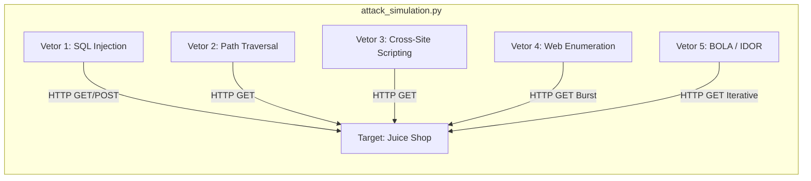

# Simulação de Ameaças Red Team e Matriz MITRE ATT&CK

## 1. Topologia de Execução Ofensiva

---

## 2. Mapeamento Tático MITRE ATT&CK

| Vetor Técnico | Tática MITRE | Técnica | Subtécnica / ID | Endpoint Alvo | Payload de Exploração |
| :--- | :--- | :--- | :--- | :--- | :--- |
| **SQLi Search** | Initial Access | Exploit Public-Facing App | `T1190` | `/rest/products/search` | `q=' OR 1=1--` |
| **SQLi Auth** | Initial Access | Exploit Public-Facing App | `T1190` | `/rest/user/login` | `{"email": "admin@juice-sh.op' OR 1=1--"}` |
| **Path Traversal**| Discovery | File and Directory Discovery | `T1083` | `/public/images/ftp/...` | `../../../../etc/passwd` |
| **Reflected XSS** | Execution | Command and Scripting Interpreter | `T1059.007` | `/rest/products/search` | `` |
| **Reconnaissance**| Reconnaissance| Active Scanning: Wordlist | `T1595.003` | Rotas de Administração | `/.env`, `/admin`, `/.git/config` |
| **BOLA / IDOR** | Defense Evasion| Direct Object Reference | OWASP API1 | `/rest/basket/{id}` | Enumeração sequencial de IDs: $[1 \dots 5]$ |

---

## 3. Dinâmica das Requisições e Comportamento de Erro

* **Cenário SQL Injection**:
  Injeta uma cláusula tautológica true. No endpoint de busca, a cláusula força o banco SQLite a ignorar a query parametrizada e retornar todo o catálogo de produtos com status `200 OK`.
* **Cenário Traversal Encoded**:
  Testa a sanitização do middleware Express servindo arquivos estáticos. O uso de `..%2f` avalia a interpretação de URLs antes de passar pelo resolvedor de arquivos do Node.js.
* **Taxa de Requisição ($R_{rate}$)**:
  Para testes de enumeração sem acionar DoS, a taxa instantânea obedece:

$$R_{rate} = \frac{\Delta N_{requests}}{\Delta t} \approx 20\text{ req/s}$$
